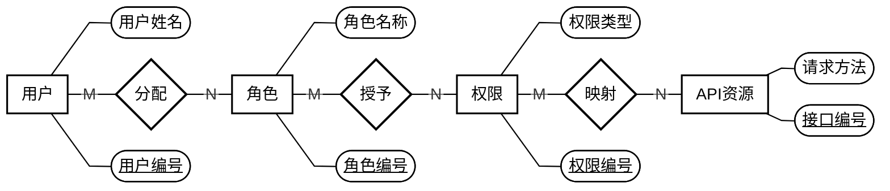
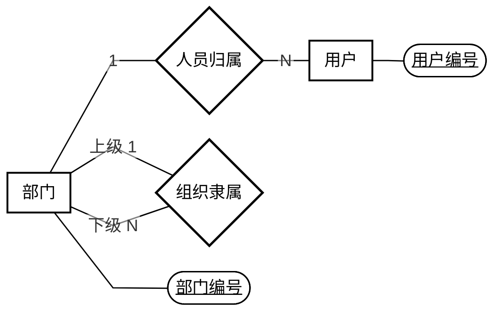
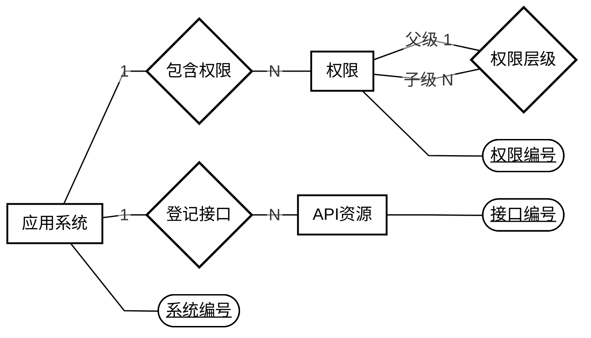

# 核心Chen ER关系源码

六实体/八类联系的已评审源码，迁自T13基线，语义未改。静态[PNG](chen-er-overview.png)/[SVG](chen-er-overview.svg)用于标准Chen符号核对，Mermaid用于关系阅读。全局管理员不是单独实体；运行支撑不进入核心图。

## 授权关系

```mermaid
%%{init: {"theme":"base","look":"classic","flowchart":{"htmlLabels":false,"curve":"linear","nodeSpacing":24,"rankSpacing":30,"padding":8},"themeVariables":{"fontFamily":"Microsoft YaHei, Arial, sans-serif","fontSize":"18px","lineColor":"#000000","edgeLabelBackground":"#ffffff","background":"#ffffff"}}}%%
flowchart LR
    U["用户"] --- UNAME(["用户姓名"])
    U ---|"M"| UR{"分配"}
    UR ---|"N"| R["角色"]
    U --- UID(["用户编号"])

    R --- RNAME(["角色名称"])
    R ---|"M"| RP{"授予"}
    RP ---|"N"| P["权限"]
    R --- RID(["角色编号"])

    P --- PTYPE(["权限类型"])
    P ---|"M"| PA{"映射"}
    PA ---|"N"| A["API资源"]
    P --- PID(["权限编号"])

    A --- AMETHOD(["请求方法"])
    A --- AID(["接口编号"])
    classDef entity fill:#ffffff,stroke:#000000,stroke-width:2px,color:#000000;
    classDef relationship fill:#ffffff,stroke:#000000,stroke-width:2.5px,color:#000000;
    classDef attribute fill:#ffffff,stroke:#000000,stroke-width:1.5px,color:#000000;
    class U,R,P,A entity;
    class UR,RP,PA relationship;
    class UNAME,UID,RNAME,RID,PTYPE,PID,AMETHOD,AID attribute;
    classDef key text-decoration:underline;
    class UID,RID,PID,AID key;
    linkStyle default stroke:#000000,stroke-width:1.4px;
```

## 组织与人员

```mermaid
%%{init: {"theme":"base","look":"classic","flowchart":{"htmlLabels":false,"curve":"linear","nodeSpacing":28,"rankSpacing":34,"padding":8},"themeVariables":{"fontFamily":"Microsoft YaHei, Arial, sans-serif","fontSize":"18px","lineColor":"#000000","edgeLabelBackground":"#ffffff","background":"#ffffff"}}}%%
flowchart LR
    D["部门"] ---|"1"| DU{"人员归属"}
    DU ---|"N"| U["用户"]

    D ---|"上级 1"| DD{"组织隶属"}
    DD ---|"下级 N"| D

    D --- DID(["部门编号"])
    U --- UID(["用户编号"])
    classDef entity fill:#ffffff,stroke:#000000,stroke-width:2px,color:#000000;
    classDef relationship fill:#ffffff,stroke:#000000,stroke-width:2.5px,color:#000000;
    classDef attribute fill:#ffffff,stroke:#000000,stroke-width:1.5px,color:#000000;
    class D,U entity;
    class DU,DD relationship;
    class DID,UID attribute;
    classDef key text-decoration:underline;
    class DID,UID key;
    linkStyle default stroke:#000000,stroke-width:1.4px;
```

## 系统归属与权限层级

```mermaid
%%{init: {"theme":"base","look":"classic","flowchart":{"htmlLabels":false,"curve":"linear","nodeSpacing":30,"rankSpacing":34,"padding":8},"themeVariables":{"fontFamily":"Microsoft YaHei, Arial, sans-serif","fontSize":"18px","lineColor":"#000000","edgeLabelBackground":"#ffffff","background":"#ffffff"}}}%%
flowchart LR
    S["应用系统"] ---|"1"| SP{"包含权限"}
    SP ---|"N"| P["权限"]
    S ---|"1"| SA{"登记接口"}
    SA ---|"N"| A["API资源"]

    P ---|"父级 1"| PP{"权限层级"}
    PP ---|"子级 N"| P

    S --- SID(["系统编号"])
    P --- PID(["权限编号"])
    A --- AID(["接口编号"])
    classDef entity fill:#ffffff,stroke:#000000,stroke-width:2px,color:#000000;
    classDef relationship fill:#ffffff,stroke:#000000,stroke-width:2.5px,color:#000000;
    classDef attribute fill:#ffffff,stroke:#000000,stroke-width:1.5px,color:#000000;
    class S,P,A entity;
    class SP,SA,PP relationship;
    class SID,PID,AID attribute;
    classDef key text-decoration:underline;
    class SID,PID,AID key;
    linkStyle default stroke:#000000,stroke-width:1.4px;
```
