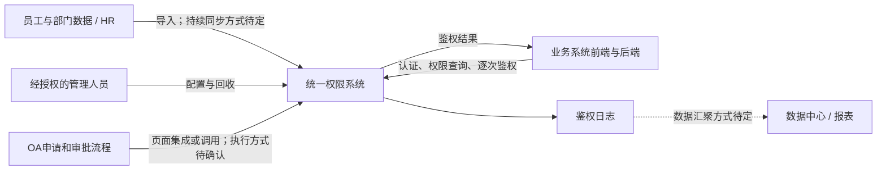

# 统一权限管理系统：录音需求分析

> 分析日期：2026-09-20。音频：`9月20日.m4a`，时长 01:03:20.538；本次只收到这一份音频。
>
> 已对整段音频完成本地分段自动转写，并逐段分析可辨识内容；对关键片段补做识别。现场有远距离说话、同学讨论和低清晰度片段，自动稿存在明显错字和幻觉。下列时间为定位区间，内容为语义归纳，不是人工听校的逐字引文。没有在可辨识内容中核实的摘要条目，均保留为待确认，不视为已被否定。

## 需求分析的判定规则

本次分析区分三类内容：**录音明确要求**、**为使需求可落地而提出的设计建议**、**仍需向需求方确认的口径**。其他组摘要作为辅助材料，不替代录音证据。录音中的课程任务和汇报要求单独记录，不转化为产品功能。

## 1. 核心结论

本项目要解决的是：**集团跨系统、跨组织的身份与功能权限统一管理，以及业务操作发生时的实时权限校验**。背景为 20 余个业务系统、十余家软件开发商、一万余名员工。当前分散账号与授权造成调岗时逐系统回收、逐系统开通、无法掌握全部权限的问题（00:00:47–00:04:45）。

其他组摘要对总体方向的归纳有参考价值，但遗漏了本份录音中的访问鉴权日志、日志永久保存、隐私信息保护、自身权限管理、初始超级管理员、系统版本演进、故障容错、报表边界和门户边界。账号命名和 RBAC 阶段要求还存在来源口径差异，不能直接将该摘要整体作为已确认需求规格。

## 2. 与其他组摘要的对照

| 主题 | 本次复核结果 | 需求文档应如何写 |
|---|---|---|
| 20余个系统集中管控、逐步改造 | 与录音一致，00:01–00:04 | 保留；新增系统也应接入，不能只做一次性迁移 |
| 菜单/功能权限 | 录音以系统功能、菜单及后端 API 校验展开，00:39–00:43 | 管理功能是否可用，并提供后端鉴权能力；菜单到接口的映射需设计 |
| 一期数据权限 | 摘要遗漏；00:02:49–00:03:57提出按道路等数据范围控制的理想目标，随后明确第一步暂不做那么细 | 当前控制功能权限；项目/道路/行记录级数据权限不纳入一期承诺 |
| 拼音首字母生成用户名 | 与本份录音多次出现的“工号或手机号登录”口径有差异，00:33:20–00:33:55、00:37:55–00:38:13、00:53:10–00:53:53 | 工号、用户名、手机号分字段；以工号/手机号作为本份录音支持的登录方式；拼音规则单独待确认 |
| HR自动抽取并生成账号 | 本音频明确了员工/部门数据导入和与HR调岗信息的关系，未充分确认持续同步方式 | 初始导入是明确需求；同步方向、周期、事件与开户时点待确认 |
| 每部门至少一管理员 | 原话更灵活：分公司至少有人负责，大公司可细分到部门；范围可配置，00:17:38–00:19:07、00:30:30–00:32:40、00:56 | 不把组织层级、管理人数或上下级权限写死 |
| 总公司天然拥有下属全部权限 | 录音反复强调“看配置”，00:18:15–00:18:47 | 总公司信息中心负责管理不等于职务天然继承全部业务权限 |
| RBAC0永久固定 | 摘要指定RBAC0；本音频00:44:07–00:45:05区分0/1级与2级，并提到12月阶段考虑限制 | 当前按课程已给定的RBAC0要求设计，但注明该约束来自摘要；后续角色约束阶段须核对任务书 |
| 权限修改立即刷新前端 | 录音明确允许菜单仍显示可用，但后端必须立即拒绝，00:41:55–00:43:20 | 必须实时改变授权结果；即时推送刷新前端不是已明确的硬性要求 |
| 无权限菜单一定灰显 | 录音表示灰显还是隐藏由业务系统实现，00:40:58–00:41:25 | 统一系统返回权限信息；不固定所有业务系统的展示方式 |
| OA审批通过后自动调用API | 审批归OA、权限系统提供基础操作与网页集成是明确的，00:11:30–00:12:35 | 不将“自动回调执行”写成唯一方案；节点中人工办理与自动调用需确认 |
| 日志 | 摘要遗漏；00:19:23、00:34:06、00:38:24–00:40:45反复说明 | 每次后端鉴权记录日志，保存期限回答为永久；不是只记录登录或授权变更 |
| 隐私保护 | 摘要遗漏；00:34:36–00:35:03提到加密与姓名、电话号码不可泄露 | 增加敏感信息保护要求，具体加密对象与方案另行设计 |
| 报表和统一门户 | 摘要未明确排除；00:19:50–00:20:50、00:48:50–00:49:25 | 报表由数据中心/数据仓库承担，业务系统导航门户不属于本次产品范围 |
| 20ms响应、50–60ms卡顿 | 在本份可辨识内容中未找到对应数值；明确高峰期、性能及可靠性要求 | 数值保留为“其他组摘要待核实”，不可直接变成所有接口的验收阈值 |
| 特殊人员手工临时开户 | 在本份可辨识内容中未充分核实流程 | 保留为补充来源，需确认开户人、必填标识、有效期及退出机制 |
| 无领导小组汇报和个人评分 | 本音频末尾主要为分组、组长和资源安排，未充分核实摘要中的完整考核方式 | 作为课程安排待核实；不混入系统功能清单 |

## 3. 系统边界与参与方

| 参与方 | 负责什么 | 边界说明 |
|---|---|---|
| 统一权限系统 | 身份及授权数据、管理页面、认证接口、功能鉴权接口、鉴权日志 | 自己的管理功能也由自己进行权限控制 |
| 业务系统及开发商 | 本系统业务逻辑、前端菜单呈现、后端操作前鉴权、接入改造 | 不继续独立维护互不一致的账号权限；数据级业务控制本期不由统一平台包办 |
| 员工 | 在获授权的系统中使用获授权的功能 | 一个账号不等于可以访问全部系统或全部功能 |
| 分公司/部门管理员 | 按职责为所辖人员授予、调整和回收权限 | 操作范围必须可配置；指定人员办理即可，不要求每部门新增专职岗位 |
| 集团信息中心 | 全局配置、分级管理与运维 | 总公司与下属公司的具体可操作范围仍由授权确定 |
| 初始超级管理员 | 系统初始化时授权第一批管理人员 | 全权限初始账号不是普通日常工作账号，00:18:47–00:19:07 |
| HR及组织数据提供方 | 员工、组织和人事变化信息 | HR部门变化不能直接等同于旧业务权限立即回收 |
| OA | 申请、审批、交接等流程流转与页面/操作集成 | 权限系统不重建审批引擎 |
| 数据中心/数据仓库 | 汇聚数据并制作报表 | 权限系统需要保留可供汇聚的数据；具体输出接口待定 |

明确不纳入一期：重建业务系统、通用审批流程引擎、统一导航门户、通用BI报表、细到具体道路/项目记录的数据权限。单点登录、第三方登录、短信验证码、MFA等在本份录音中未得到足够明确的确认，不默认加入。

## 4. 可追踪需求清单

状态“录音明确”表示可辨识的问答支持其业务含义，不代表自动转写每个字均准确。以下编号可供设计文档、接口与测试用例引用。

| 编号 | 需求表述 | 来源时间 / 状态 |
|---|---|---|
| FR-01 | 系统应集中管理集团多个业务系统的用户与功能权限，支持逐系统接入 | 00:01:20–00:04:45，录音明确 |
| FR-02 | 应提供各业务系统调用的登录/认证能力与权限检查接口 | 00:04:22–00:04:45、00:52:10–00:52:48，录音明确 |
| FR-03 | 应支持员工与部门数据初始导入；员工信息作为用户来源 | 00:06:10–00:06:44、00:33:18–00:33:40，录音明确 |
| FR-04 | 应支持工号/手机号加密码登录，并维护对应标识的唯一性 | 00:33:40–00:33:55、00:37:55–00:38:13、00:53:10–00:53:53，录音支持；与摘要命名规则冲突待定 |
| FR-05 | 应能够定义各系统的功能权限集合，并配置哪些用户可以使用哪些功能 | 00:21:40–00:24:00、00:32:20–00:32:40，录音明确 |
| FR-06 | 应支持一个用户持有多个组织所需的权限，当前不强制互斥 | 00:44:07–00:45:05，录音明确；角色模型按阶段要求另行确认 |
| FR-07 | 应按可配置的组织与管理范围分配管理职责 | 00:17:38–00:18:47、00:30:30–00:32:40、00:56:00–00:56:35，录音明确 |
| FR-08 | 权限系统自身的用户、角色、授权等功能也应受权限控制，并提供初始化授权入口 | 00:16:31–00:16:45、00:18:47–00:19:07、00:31:40–00:32:40，录音明确 |
| FR-09 | 应提供基础权限维护界面/操作，支持OA网页集成；申请审批由OA负责 | 00:11:30–00:12:35、00:19:10–00:19:23，录音明确 |
| FR-10 | 应支持管理人员在交接完成后回收旧权限；不因HR先改部门就自动撤销全部旧权限 | 00:47:00–00:47:47，录音明确 |
| FR-11 | 离职交接完成后，应可集中回收该员工在相关业务系统的权限 | 00:55:20–00:55:50，录音明确；账号保留/禁用策略待确认 |
| FR-12 | 应向业务系统提供当前用户的权限集合以控制菜单，同时提供每次后端操作的权限检查 | 00:39:42–00:40:45、00:54:20–00:54:43，录音明确 |
| FR-13 | 权限撤销提交后，后续鉴权应按新权限判断，不能等用户下次登录才生效 | 00:41:55–00:43:20，录音明确；在途请求的提交边界待确认 |
| FR-14 | 应记录每次后端鉴权，包括时间、用户/用户名、目标功能和成功/失败结果 | 00:19:23–00:19:49、00:38:24–00:40:45、00:52:45–00:52:55，录音明确 |
| FR-15 | 应支持新增业务系统、已有系统升级导致的权限增减、业务系统退出 | 00:16:55–00:17:23，录音明确 |
| FR-16 | 应控制用户可进入哪些系统，以及进入后可使用哪些功能 | 00:48:50–00:49:23，录音明确；系统准入权限的具体表示待设计 |
| NFR-01 | 应支持7:45–8:30一万余员工集中登录并开始业务操作的高峰场景 | 00:21:00–00:21:40，录音明确 |
| NFR-02 | 应具备可靠性和容错能力，避免统一服务故障影响全集团业务 | 00:55:00–00:55:18，录音明确；可用率、恢复目标待确认 |
| NFR-03 | 应考虑节省服务器资源，在性能要求下控制资源成本 | 00:45:14–00:45:34，录音支持 |
| NFR-04 | 日志按宣讲口径永久保存 | 00:34:06–00:34:11，录音明确；归档与查询时效待确认 |
| NFR-05 | 应保护用户隐私信息，避免姓名、电话号码等泄露，并按确认范围进行加密 | 00:34:36–00:35:03，录音支持；字段、密钥与展示策略待设计 |

补充来源待确认项：拼音命名规则、外包临时账号流程、20ms响应阈值、RBAC0确切阶段交付与无领导汇报细则。它们不应伪装成已有音频证据的FR/NFR条目。

## 5. 关键流程及设计判断

### 5.1 入职、调岗、离职

初始导入员工与部门，建立身份；再由有权限的管理员依据岗位需要分配角色/功能。连续HR同步、初始密码发放、账号启用、密码重置等还需要补问，不能凭“员工数据来自HR”推导成全自动开户授权。

调岗流程应把**人事任职状态**和**业务授权状态**分开：HR可能已经把人调到新部门，原岗位还在交接，因此原权限暂时有效；交接完成后由有权人员回收，再按新岗位需求授权。录音没有充分固定新岗位授权与旧岗位回收的绝对先后顺序，不宜写成强制串行，更不能根据department_id变化直接清空全部角色。

离职同样存在交接和权限回收。是否禁用登录、吊销全部会话、保留历史用户、处理再入职，都需进一步定义。历史日志中的人员标识应能持续关联，不宜直接物理删除用户。

### 5.2 认证、系统准入、功能鉴权

这三件事应分别定义：身份凭据是否有效、用户能否进入某个系统、用户当前能否执行某个功能。共享同一账号密码并不能自动证明已要求“登录一次后其他系统免登录”的单点登录体验。

业务系统启动时获取权限集合用于菜单展示；每次执行受控后端操作，再请求当前鉴权结果。前端隐藏/灰显只能改善交互，不能替代服务端校验。平台只回答权限问题，不替业务系统执行车辆管理、巡检、GIS等业务功能。

一个菜单可能对应多个API，同一API也可能服务多个入口。因此“菜单是权限配置单元”还需落成明确的**系统—功能权限—后端操作映射**。是否区分查看、编辑、删除、导出，以及父菜单和子菜单授权关系，当前仍缺口径。

### 5.3 实时撤权的准确含义

00:42:45–00:43:20的解释强调以撤权提交为先后分界。建议至少验收：**撤权提交完成之后新发起的鉴权请求必须拒绝已失去权限的操作**。不能把“缓存5分钟后刷新”或“下次登录后生效”称为满足该要求。

角色权限改变也会影响该角色的所有用户，不能只处理单用户撤权。若使用权限缓存，须给出符合该一致性要求的读取/失效机制；仅凭异步通知最终刷新不足以证明严格即时生效。具体采用集中读取、版本校验或其他一致性方案属于实现设计。

仍需确认：撤权前已经通过鉴权、撤权后才产生业务写入的在途操作是否允许完成。若要求连在途写入也停止，需要业务系统参与定义事务提交边界，单纯增加一次远程鉴权并不自动消除竞争条件。前端菜单即时推送更新是可选体验，不替代上述验收。

### 5.4 鉴权日志不是普通登录日志

必需记录的是“哪个用户在什么时候请求哪个功能，权限检查结果如何”，重点为后端API鉴权，而非只在登录时写一条日志。建议补充稳定user_id、app_id、permission_code、request_id和权限版本，方便追踪；这些扩展字段属于设计建议。

日志永久保存是本次问答给出的口径，不应擅自改成90天。可以提出冷热归档、压缩、分区与数据中心汇聚方案，但在线可查询年限、检索时效、增长量和存储预算仍待确认。IP未被提出为必需字段；关于IP的回答涉及接入网络背景，其中专有名词识别不清，不能据此确定VPN等强制接入要求。

需要区分“鉴权允许”与“业务办理成功”：权限系统能直接确认前者；后者还可能因业务校验或数据库写入失败而未完成。若要记录业务成功，需要额外结果回传，不能把授权成功直接当作业务成功。

授权管理变更日志同样有价值，但与访问鉴权日志是两个不同对象。前者是本分析的补充建议，不能用前者替代录音已要求的后者。

### 5.5 RBAC0与管理范围

按照其他组摘要所给的RBAC0约束，可采用用户、角色、权限、会话以及两组多对多关联。若当前会话激活其获授的全部有效角色，有效权限为这些角色权限集合的并集；如果允许只激活部分角色，则取激活角色的并集。需要明确选择，避免授权存在但会话没有启用的歧义。

“只配置允许权限”不表示所有访问都允许：未被任何有效角色授予的权限，应拒绝。多个角色权限并集解决的是授权合并规则，**不会自动消除职责冲突、错授或越权**。移除一个角色时，其他角色授予的同一权限仍然有效。

组织树可以有上下级，但不能因此自动生成角色继承。管理员“能管理哪些人”和“能授予哪些角色”也需要分别约束，否则一个部门管理员可能通过改写用户或角色范围给自己加权。

录音00:44–00:45还出现了12月阶段再考虑约束的教学提示。应向老师核对当前/后续阶段的RBAC0、RBAC1、RBAC2边界，不提前实现全部，也不把后续约束永远排除。

### 5.6 性能与可靠性

一万余人在45分钟内使用系统，不能直接等同于“一万并发”。仅以10,000人各登录一次、均匀分布作算术示例，平均约为 `10000 / (45×60) = 3.70次登录/秒`，该数字既不是峰值，也不包含每次业务操作触发的鉴权请求，因此不能据此确定服务器容量。

压测需补齐：高峰秒级登录量、同时在线人数、人均操作频率、每个动作触发多少鉴权、登录/查询/鉴权/变更的混合比例、日志写入开销、网络部署位置、失败率与持续时间。

摘要中的20ms若最终属实，还需明确它适用于哪个接口、服务端处理还是端到端、P95/P99还是平均值、是否含VPN/网络/日志持久化，以及指定硬件与负载。录音未确定技术栈、服务器数量、可用率、RTO/RPO。多实例、故障切换、监控和日志归档属于待评审方案，不写成老师指定架构。

统一服务不可用时，“继续相信旧权限”和“严格实时撤权”可能发生冲突。需确认失败时拒绝、短时降级或其他策略；任何降级都应作为显式业务决策，不能静默放行。

## 6. 设计推导：数据模型

以下为设计建议，不是录音已指定的数据表或字段。可以作为后续“数据设计”交付的起点。

| 实体/关系 | 关键字段示例 | 设计目的 |
|---|---|---|
| 用户 User | user_id、employee_no、username、姓名、手机号、人员来源、状态 | 工号与登录别名分字段；内部身份使用不随姓名、电话变化的稳定标识 |
| 外部身份映射 | source_system、source_person_id、user_id | HR 同一记录重复同步时更新已有账号，避免重复建人 |
| 部门 Department | department_id、parent_id、名称、状态 | 表达组织树；组织上下级不自动推导角色权限继承 |
| 任职 Assignment | user_id、department_id、岗位、主/兼任标记、有效期 | 一人跨部门或兼岗时不复制账号 |
| 业务系统 Application | app_id、app_code、接入状态 | 划分各系统的权限命名空间 |
| 菜单 Menu | menu_id、app_id、parent_id、名称、路由、排序 | 支持菜单展示和权限配置；菜单父子关系不等于角色继承 |
| 权限 Permission | permission_id、app_id、permission_code、关联菜单 | 使用稳定权限编码，避免改名或调整菜单层级导致授权漂移 |
| 角色 Role | role_id、名称、所属管理范围、状态 | 作为权限集合，供用户复用 |
| 用户角色 UserRole | user_id、role_id、授予来源、授予人、状态 | 记录用户获得角色的来源，支持按原部门回收而保留其他合法授权 |
| 角色权限 RolePermission | role_id、permission_id | 多对多关联，权限重复时去重 |
| 管理范围 AdminScope | admin_user_id、department_id、可管理角色范围 | 限定管理员可管理的人及可授予的角色，防止部门管理员越权 |
| 会话 Session | session_id、user_id、有效期、撤销状态 | 跟踪身份会话；有效会话不代表某项操作权限仍有效 |
| 鉴权访问日志 | event_id、时间、user_id、登录名、app_id、功能、鉴权结果 | 落实逐次后端鉴权日志需求；录音口径为永久保留 |
| 授权变更记录 | change_id、操作者、目标、前后差异、时间、来源 | 排查错授、漏回收、角色批量修改的影响；审计保留周期待确认 |
| OA 执行记录（若采用自动执行） | request_id、OA单号、变更摘要、状态、结果 | 区分审批通过与执行成功；支持重复回调幂等和失败重试 |

重要关系：`User ↔ Role ↔ Permission → Application`。用户与角色、角色与权限均为多对多。部门是管理范围，岗位是业务职能，角色是权限集合，三者不能混成一个字段。一个角色是否跨系统、同名岗位是否共享角色，需要结合组织实际确认。

## 7. 设计推导：界面与接口

### 界面清单

| 页面 | 主要操作 | 必须表达的信息 |
|---|---|---|
| 用户与任职 | 查询用户、查看任职、维护特殊人员账号 | 人员来源、账号状态、部门与兼任关系 |
| 用户授权 | 为用户分配/移除角色 | 授予前后权限差异、授权来源、操作者管理范围 |
| 角色管理 | 维护角色及角色权限 | 角色影响哪些用户，修改后会影响哪些系统 |
| 系统与菜单 | 登记接入系统、维护菜单及权限映射 | 稳定编码、菜单层级、接入状态 |
| 部门管理员 | 配置管理范围 | 可管理用户范围与可授予角色范围 |
| 鉴权日志查询（页面建议） | 查询用户功能访问的鉴权结果 | 数据记录为明确需求；平台内查询页及查询范围需确认，不能扩成通用报表平台 |
| 变更记录（建议） | 查询变更与执行结果 | 操作者、时间、原因、前后差异、OA关联单号 |
| OA 嵌入授权页 | 在指定流程节点办理权限变更 | 当前操作者、目标用户、变更内容、执行反馈 |

### API 能力清单

以下仅定义能力，不擅自确定 REST 路径、认证协议或开发框架。

| 能力 | 主要输入 | 主要输出/约束 |
|---|---|---|
| 统一认证 | 工号/手机号、密码、接入系统身份 | 用户身份与会话凭证；具体协议待定，密码不写入日志 |
| 会话检查/退出 | 会话凭证 | 有效状态或退出结果；跨系统退出口径待定 |
| 查询用户信息 | 可验证的用户标识 | 按调用方授权返回必要信息 |
| 查询有效菜单权限 | 用户会话、app_id | 当前系统内可用权限，供前端展示 |
| 检查操作权限 | 用户会话、app_id、permission_code | 允许/拒绝及可追踪决策标识；不能只信任前端传入的 user_id |
| HR 同步 | HR人员与组织记录 | 新增/更新/异常结果；重复同步不重复建账号 |
| 用户角色维护 | 目标用户、角色集合、变更原因 | 范围校验、前后差异、执行状态 |
| 角色权限维护 | 角色、权限集合 | 范围校验与影响用户范围 |
| 系统菜单维护 | 系统、菜单、权限映射 | 创建/更新结果与配置校验 |
| 日志汇聚（形式待定） | 鉴权事件、增量游标或批次 | 向数据中心提供可追踪数据；拉取、推送或ETL方式待确认 |
| OA 执行/查询（如需要） | OA单号、请求标识、获批变更 | 幂等执行结果与可查询状态；审批结果来源须可信 |

任何修改入口，包括嵌入页面与 API，都必须在服务端校验操作者可管理范围。页面嵌入成功不代表获得授权。业务系统也不能通过请求参数把自身伪装成另一个接入系统。

## 8. 设计推导：验收场景

这些场景用于将需求转成可检查行为；尚无明确数值的性能、失效时限和故障策略不预设通过阈值。

| 场景 | 建议验收结果 |
|---|---|
| 同一 HR 人员重复同步 | 更新同一 user_id，不新增重复账号 |
| 工号或手机号重复 | 不静默覆盖或错误合并用户，报告冲突；人员唯一匹配规则需确认 |
| 同一员工使用工号/手机号登录 | 识别为同一用户；已停用的旧手机号不能继续登录 |
| 同一员工在两个部门任职 | 仍使用一个账号，保留多个任职和角色关联 |
| 两角色都授予同一权限 | 有效权限去重，移除其中一个角色后仍保留另一角色提供的权限 |
| 所有角色都未授予某权限 | 后端拒绝访问，即使用户自行构造 URL 或直接调用接口 |
| 部门管理员修改外部门员工 | 服务端拒绝，且不能通过修改请求参数绕过 |
| 用户登录后被回收权限 | 撤权提交后的新鉴权请求立即按新权限拒绝；不依赖重新登录 |
| 修改一个角色的权限 | 所有关联用户按同一生效规则更新 |
| 调岗完成原部门交接 | 移除原授权来源，不误删兼岗或其他部门仍然有效的授权 |
| 同名菜单分属两个系统 | 系统命名空间隔离，不串用权限 |
| 后端鉴权允许及拒绝 | 两种结果均生成时间、用户、功能和结果等日志，不能只记成功 |
| 某业务系统升级或停用 | 可以增减对应功能权限；停用后的准入及旧权限处理符合确认规则 |
| 管理员使用权限平台自身功能 | 同样鉴权，不能仅因“管理员”标签而拥有所有管理操作 |
| 日志永久保存与归档 | 归档后仍保留记录，按确认的检索时效可恢复或查询；不自动超期删除 |
| OA 重复发送同一获批变更 | 若采用自动执行，不产生重复授权，返回可追踪的同一执行结果 |
| OA 审批通过但执行失败 | 若采用自动执行，能区分失败与成功并支持补偿处理 |
| 权限服务异常 | 按事先确认的失败策略处理；不能悄悄绕过权限检查 |
| 早高峰压测 | 以确认的峰值请求率、并发、业务混合比例和网络边界验收 |

## 9. 下一次需求访谈优先问题

以下是供小组向需求方核对的问题，不表示当前请求必须等待这些答案才能完成分析。

1. **账号口径**：本班录音中的“用户名就是工号”与其他组“姓名拼音首字母”是否对应不同版本？手机号变更、号码复用、无工号人员分别如何处理？
2. **阶段边界**：本阶段明确要求RBAC0吗？12月阶段究竟增加哪些约束？角色继承、互斥角色和数据权限分别在哪一期？
3. **授权粒度**：系统准入是否单独授权？菜单下查看/新增/编辑/删除/导出是否区分？授权父菜单是否自动授权子菜单？
4. **管理员范围**：可管本部门还是含下级部门？能授予哪些角色、能否修改共享角色、能否授权自己？原部门如何在HR已变更任职后继续完成旧权限交接回收？
5. **OA执行方式**：审批节点内人工操作，还是审批通过后自动调用？如何证明操作已获审批？审批通过但执行失败由谁处理？紧急撤权是否仍需先走完整审批？
6. **实时边界**：以撤权提交后的新鉴权为边界是否足够？已经通过鉴权的长事务、导出任务、批量处理是否中断？权限服务不可用时如何处理？
7. **性能指标**：20ms是否为本项目正式要求？针对哪个接口、哪种网络和负载、哪个百分位？高峰请求率、成功率、可用率、恢复时间是多少？
8. **日志与隐私**：永久日志中哪些需永久在线？归档检索多快？谁可以查阅和导出？“成功”指鉴权成功还是业务成功？哪些字段必须加密或脱敏？
9. **HR生命周期**：初始导入之后如何同步？开户/禁用时点是什么？离职、再入职、兼岗、外包到期分别由谁发起变更？
10. **现有资料**：补齐员工、部门、系统功能/菜单清单，确认提供的是实际业务资料还是AI示例，取得OA嵌入规范与接口约束。

## 10. 可直接用于小组后续设计的交付清单

根据用户提供的其他组摘要，后续任务涉及RBAC0模型、数据设计、界面设计和API设计。建议按以下顺序落实；具体课程格式和考核方式再与任务书核对。

| 交付 | 最小应包含内容 | 与本分析的关联 |
|---|---|---|
| 需求规格 | 参与方、边界、FR/NFR编号、来源时间、待确认项 | 第2–5节 |
| RBAC模型 | 用户/角色/权限/会话、关系基数、并集规则、管理范围、阶段外能力 | 第5.5节 |
| 数据设计 | ER图、字段字典、唯一约束、HR身份映射、鉴权日志与变更日志分开 | 第6节 |
| 流程设计 | 初始导入、授权、调岗交接、离职回收、认证鉴权、OA集成 | 第5节 |
| 界面设计 | 管理员可见范围、用户授权、角色权限、系统菜单、OA嵌入页 | 第7节 |
| API设计 | 调用方身份、输入输出、权限检查、错误码、幂等、版本与日志 | 第7节 |
| 验收设计 | 场景、前置数据、操作、期望结果、性能边界 | 第8节 |

本次已提供需求分析与上述设计起点，未制作完整界面原型、数据库DDL或可部署接口实现，也未把未确认数值作为已通过的测试结果。

## 11. 全段录音内容索引

下表覆盖整段时间范围。课堂内同学私下讨论、长停顿、明显识别幻觉以及无法确定发言身份的片段不直接转化为需求；有意义的提问以讲解者的回答为依据。

| 时间段 | 内容归纳 |
|---|---|
| 00:00–00:05 | 集团业务背景、分散权限痛点、一期功能权限范围、20余系统逐步接入 |
| 00:05–00:10 | 需求提问安排、员工/部门及功能资料说明；部分为停顿和现场讨论 |
| 00:10–00:15 | OA统一审批与网页集成、权限示例说明；夹杂低清晰度讨论 |
| 00:15–00:20 | 自身权限管理、新系统和版本变化、分级管理员、超级管理员、日志与报表分工 |
| 00:20–00:25 | 数据仓库负责报表、早高峰负载、岗位与所用功能可配置；部分为同学讨论 |
| 00:25–00:30 | 主要为现场分组讨论、停顿和不清晰片段，未据此增加明确需求 |
| 00:30–00:35 | 管理范围可配置、自身功能受控、员工部门导入、工号/手机号登录、日志保存与隐私 |
| 00:35–00:40 | 部分现场讨论；随后讲解密码登录、鉴权日志字段、前后端权限控制 |
| 00:40–00:45 | 后端逐次鉴权、菜单展示由业务方决定、即时撤权、多个部门权限及RBAC级别 |
| 00:45–00:50 | 阶段约束与资源成本、休息、HR调岗不等于即时撤权、交接、明确排除门户 |
| 00:50–00:55 | 部分现场讨论；随后说明鉴权API职责、再次确认工号/手机号与逐次校验 |
| 00:55–01:00 | 可靠性和容错、离职交接与权限回收、管理人员安排；末段进入课程组织说明 |
| 01:00–01:03:20 | 分组、组长、云资源/额度等课程安排及现场交谈，不纳入产品需求；具体数值和平台名称不据低清晰度稿作为正式通知 |

## 技术依据与材料限制

RBAC0 的用户—角色、角色—权限关系与会话概念，参考 [Sandhu 等《Role-Based Access Control Models》](https://csrc.nist.gov/csrc/media/projects/role-based-access-control/documents/sandhu96.pdf)。本项目若采用角色权限并集，应明确会话激活角色的规则；角色层级继承和互斥角色约束不是 RBAC0 的基本能力。该文献只解释模型，不作为本次业务需求来源。

原始音频保留在用户提供的位置；本目录保存带时间戳的自动转写稿、分段识别JSON、重点片段复核稿和本地处理脚本。自动转写中的“全线/全新”等在上下文明确时按“权限”归纳；“公号/公报”结合反复问答按“工号”归纳。不将无法确定的公司名称、系统名称和旁边同学意见编造成已确认要求。本次未收到录音提及的员工/部门Excel或系统菜单明细，未对其中真实数据进行验证。
